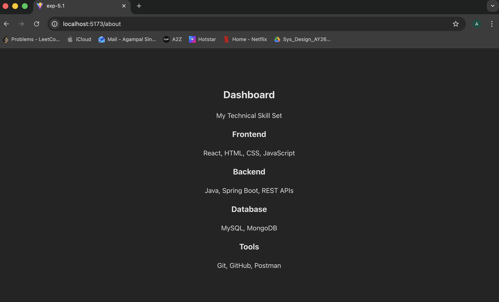
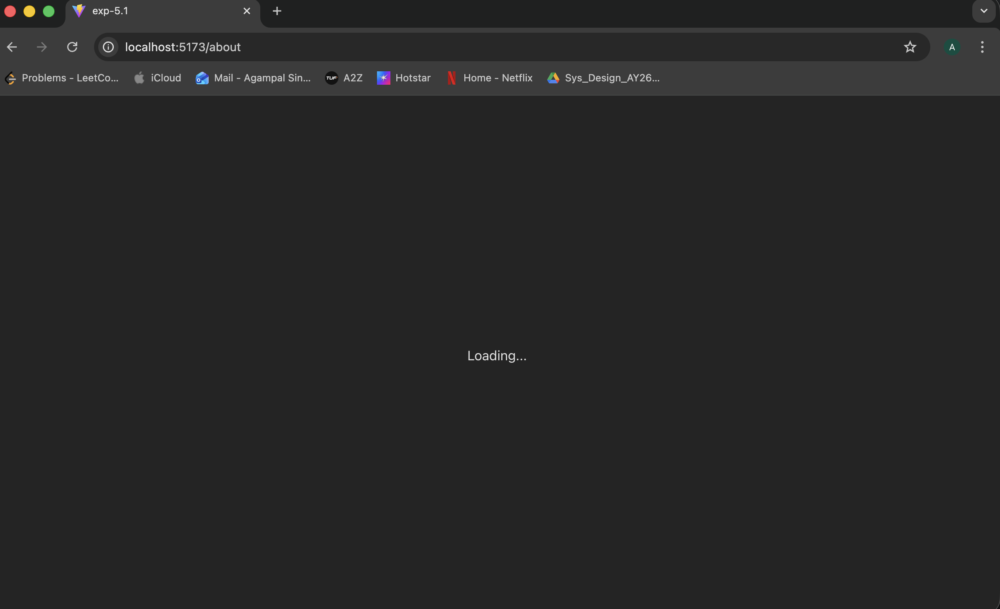
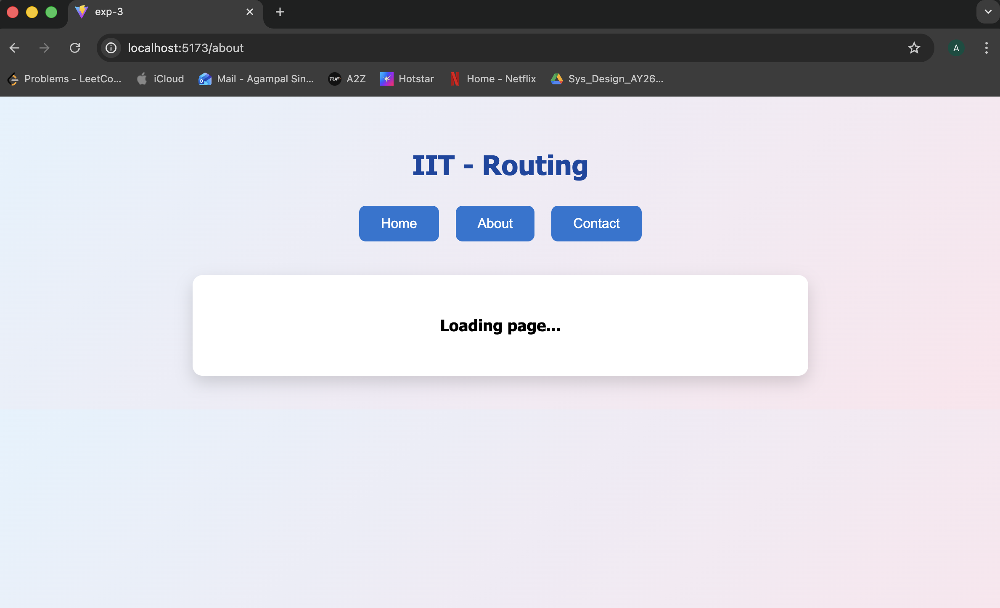
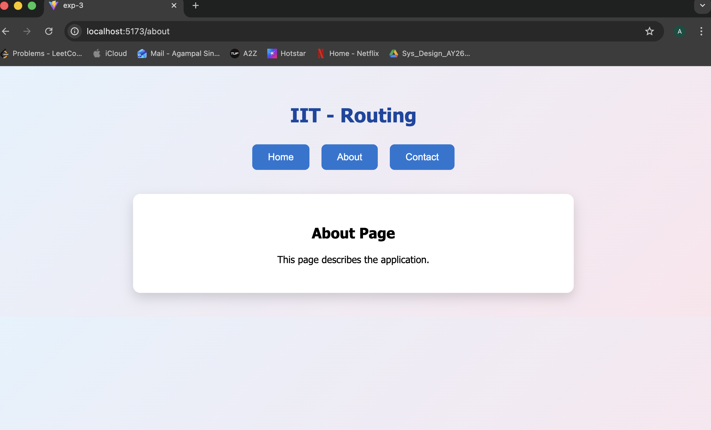
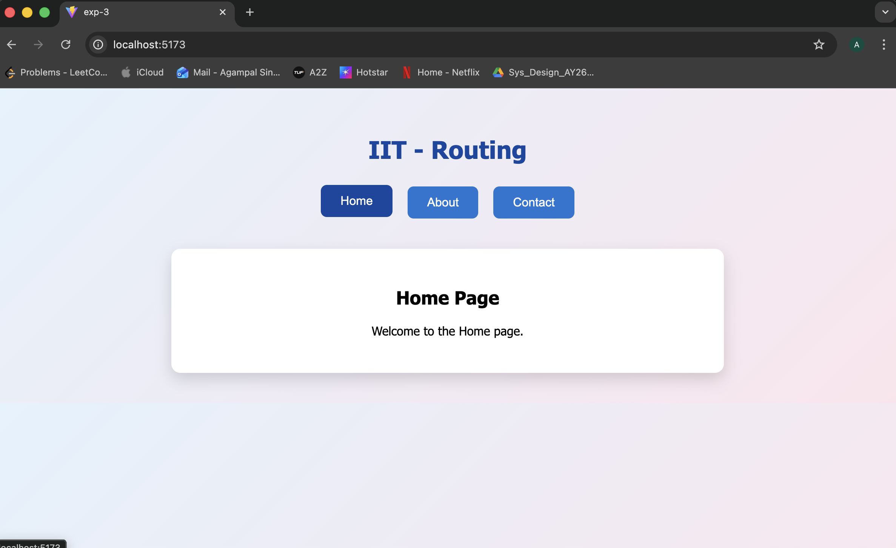

# 📦 React Lazy Loading Experiment

This project demonstrates how to use **React.lazy()** and **Suspense** for code-splitting and lazy loading components in a React application.

It also includes an artificial delay using `setTimeout` to simulate slow network loading for learning and testing purposes.

---

## 🚀 What This Project Demonstrates

- ✅ Code splitting using `React.lazy()`
- ✅ Fallback UI using `Suspense`
- ✅ Artificial loading delay simulation
- ✅ Improved performance using dynamic imports

---

## 📂 Project Structure

```
exp - 5.1
src/
 ├── components/
 │    └── Dashboard.jsx
 ├── App.js
 └── App.css
```


```
exp - 5.2
src/
 ├── components/
 │    └── Home.jsx
 │    └── About.jsx
 │    └── Contact.jsx
 ├── routes/
 │    └── AppRoutes.jsx
 ├── App.js
 └── App.css
```
---

## 🧠 Concepts Used

### 🔹 React.lazy()

`React.lazy()` allows you to dynamically import a component only when it is needed.

```js
const Dashboard = lazy(() => import('./components/Dashboard'));
```

This reduces the initial bundle size and improves performance.

---

### 🔹 Suspense

`Suspense` allows you to show fallback UI while the lazy-loaded component is being loaded.

##  Screenshots
### Exp 5.1
###  Dashboard Page


###  Loading State


### Exp 5.2
###  About-Loading Page

###  About Page

###  Contact-Loading Page

###  Contact Page

###  Home-Loading Page

###  Home Page



## 🏃‍♂️ How to Run the Project

1. Install dependencies:
   ```bash
   npm install
   ```

2. Start the development server:
   ```bash
   npm start
   ```
   or (if using Vite):
   ```bash
   npm run dev
   ```

3. Open your browser at:
   ```
   http://localhost:3000
   ```

---

## 🎯 Why Use React.lazy?

- Reduces initial bundle size
- Improves performance
- Loads components only when required
- Better user experience for large applications

---

## 📌 When to Use Lazy Loading

- Large dashboards
- Admin panels
- Route-based components
- Heavy third-party libraries
- Multi-page applications

---

## 🔥 Future Improvements

- Add a spinner loader
- Add skeleton UI
- Add route-based lazy loading with React Router
- Remove artificial delay for production

---

## 🏁 Conclusion

This experiment demonstrates how **React lazy loading works internally** and how `Suspense` handles asynchronous component rendering.

It’s a foundational concept for optimizing large React applications.
